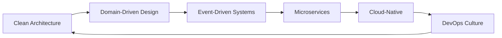

<div align="center">

<!-- BANNIÈRE ANIMÉE -->


<!-- TYPING SVG ANIMATION -->
<a href="https://git.io/typing-svg"></a>

<!-- BADGES SOCIAUX ANIMÉS -->
<p align="center">
  <a href="https://github.com/Wiizer">
    
  </a>
  <a href="https://discord.com/users/123659190044034078">
    
  </a>
  <a href="https://www.youtube.com/@Wiizer-b7n">
    
  </a>
  <a href="https://www.twitch.tv/wiizerstudio">
    
  </a>
  <a href="https://www.paypal.com/paypalme/WiizerCode">
    
  </a>
</p>

<!-- COMPTEURS LIVE -->
<p align="center">
  
  
  
</p>

</div>

---

<div align="center">

## 🎯 **VISION & MISSION**

</div>

```ascii
╔══════════════════════════════════════════════════════════════╗
║  🚀 Builder obsédé par l'impact et l'innovation             ║
║  🎮 Créer des systèmes qui scalent et des expériences uniques║
║  ⚡ Mode: ACCÉLÉRATION sur IA × Games × Automation          ║
╚══════════════════════════════════════════════════════════════╝
```

<div align="center">

**🔥 Construire • Innover • Livrer • Répéter 🔥**

</div>

---

## 💻 **TECH STACK & ARSENAL**

<div align="center">

### **Core Languages**


### **Runtime & Frameworks**


### **Game Development**


### **AI & Machine Learning**


### **Database & Cloud**


### **Tools & DevOps**


</div>

---

## 🚀 **CURRENT FOCUS - 2024**

<table>
<tr>
<td width="50%" valign="top">

### 🤖 **AI Engineering**
- 🧠 RAG Systems & AI Agents
- 🎨 Generative AI pour la création
- 🔗 LangChain & OpenAI Integration
- 🚀 Workflow Automation Avancée

</td>
<td width="50%" valign="top">

### 🎮 **Game Development**
- 🛠️ Unity Tools & Editor Extensions
- ⚙️ Gameplay Systems Architecture
- 🎨 Procedural Generation
- 🔧 Custom Game Pipelines

</td>
</tr>
<tr>
<td width="50%" valign="top">

### ⚡ **Backend & DevOps**
- 🏗️ Microservices Architecture
- 🔄 Event-Driven Systems
- 📦 CI/CD Pipelines Optimisées
- 🚀 Performance Engineering

</td>
<td width="50%" valign="top">

### 🎵 **Creative Tech**
- 🎨 Generative Art & Music
- 🤖 AI-Powered Creation Tools
- 🎬 Visual Effects & Automation
- 🔮 Experimental Projects

</td>
</tr>
</table>

---

## 📊 **GITHUB ANALYTICS**

<div align="center">


<!-- TROPHIES -->


</div>

---

## 🎯 **PROJECTS SHOWCASE**

<div align="center">

<!-- REPOS CARDS -->
<a href="https://github.com/Wiizer/project-one">
  
</a>
<a href="https://github.com/Wiizer/game-toolkit">
  
</a>

<a href="https://github.com/Wiizer/ai-agent-lab">
  
</a>
<a href="https://github.com/Wiizer/creative-automation">
  
</a>

</div>

---

## 📈 **CODING ACTIVITY**

<div align="center">

<!-- WAKATIME STATS -->
<!--START_SECTION:waka-->
<!--END_SECTION:waka-->

### **🕐 Weekly Development Breakdown**

```text
TypeScript   12 hrs 30 mins  ████████████░░░░░  45.2%
Go           7 hrs 15 mins   ███████░░░░░░░░░░  26.3%
Python       4 hrs 20 mins   ████░░░░░░░░░░░░░  15.7%
Rust         2 hrs 10 mins   ██░░░░░░░░░░░░░░░   7.8%
Other        1 hr 25 mins    █░░░░░░░░░░░░░░░░   5.0%
```

</div>

---

## 🛠️ **CLI TOOLING PERSONNEL**

<div align="center">

```bash
╔═══════════════════════════════════════════════════════════╗
║                    🔧 DEV TOOLKIT                        ║
╠═══════════════════════════════════════════════════════════╣
║                                                           ║
║  📦 dev new project        → Scaffolding full-stack      ║
║  🚀 dev ship release       → Versioning + Changelog auto ║
║  🔄 dev sync ecosystem     → Sync multi-plateformes      ║
║  📊 dev stats              → Analytics de productivité   ║
║  🤖 dev ai assistant       → Helper IA pour dev          ║
║  🎮 dev game setup         → Setup Unity/Unreal project  ║
║                                                           ║
╚═══════════════════════════════════════════════════════════╝
```

</div>

---

## ⚙️ **AUTOMATIONS & WORKFLOWS**

<div align="center">

| 🤖 Automation | 📊 Status | 🎯 Purpose |
|--------------|-----------|-----------|
| **Profile Auto-Update** | ✅ Active | Mise à jour dynamique du README |
| **WakaTime Sync** | ✅ Active | Stats de coding en temps réel |
| **Project Releases** | ✅ Active | Changelog auto + versioning |
| **Discord Bot** | ✅ Active | Notifications de commits/releases |
| **Portfolio Sync** | ✅ Active | Sync GitHub → Site perso |
| **AI Commit Messages** | 🔄 Beta | Génération auto de commits |

</div>

---

## 🎓 **ARCHITECTURE PATTERNS & PRINCIPLES**

<div align="center">



**📚 Core Principles**: SOLID · DRY · KISS · YAGNI · Clean Code · TDD

</div>

---

## 🌟 **CONTRIBUTIONS GRAPH**

<div align="center">


</div>

---

## 💡 **RANDOM DEV QUOTE**

<div align="center">


</div>

---

## 📬 **LET'S CONNECT**

<div align="center">

### **💬 Open to collaborations, projects & opportunities**

<p>
  <a href="https://discord.com/users/123659190044034078">
    
  </a>
  <a href="https://www.youtube.com/@Wiizer-b7n">
    
  </a>
  <a href="https://www.twitch.tv/wiizerstudio">
    
  </a>
  <a href="https://www.paypal.com/paypalme/WiizerCode">
    
  </a>
</p>

### **🚀 Always building, always learning, always shipping.**

```ascii
   ___       ___       ___       ___       ___       ___   
  /\  \     /\  \     /\  \     /\__\     /\  \     /\  \  
 /::\  \   _\:\  \   _\:\  \   /:/__/_   /::\  \   /::\  \ 
/:/\:\__\ /\/::\__\ /\/::\__\ /::\/\__\ /::\:\__\ /::\:\__\
\:\ \/__/ \::/\/__/ \::/\/__/ \/|::/  / \:\:\/  / \;:::/  /
 \:\__\    \:\__\    \:\__\     |:/  /   \:\/  /   |:\/__/ 
   \/__/     \/__/     \/__/     \/__/     \/__/     \|__|  
```

---

<p align="center">
  
</p>

</div>
